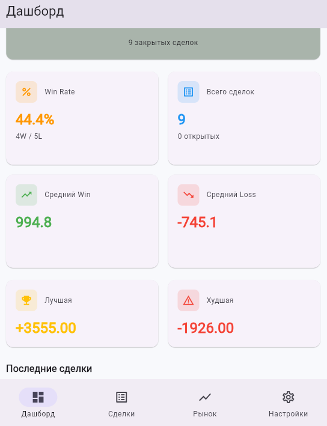
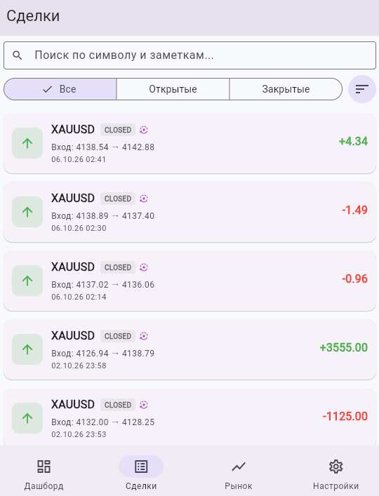
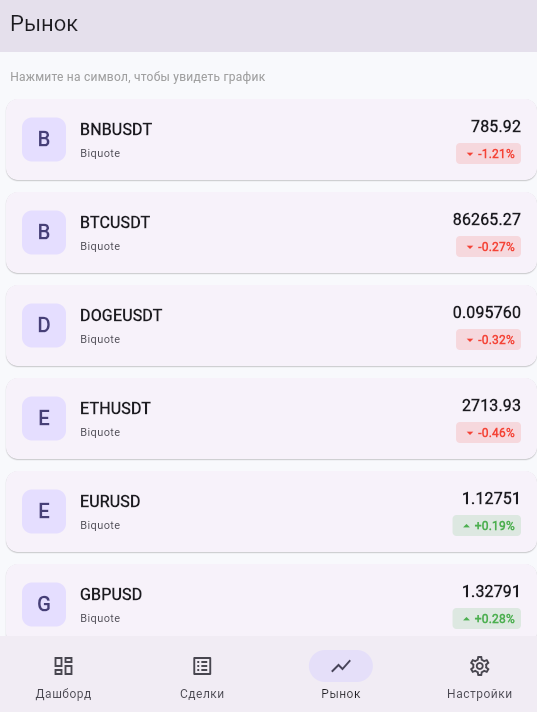
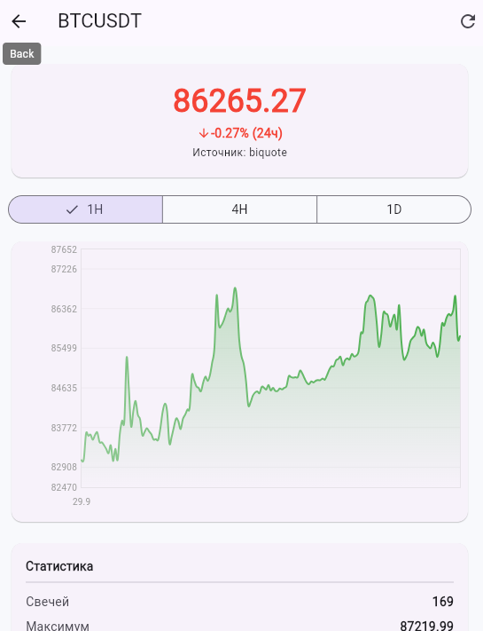
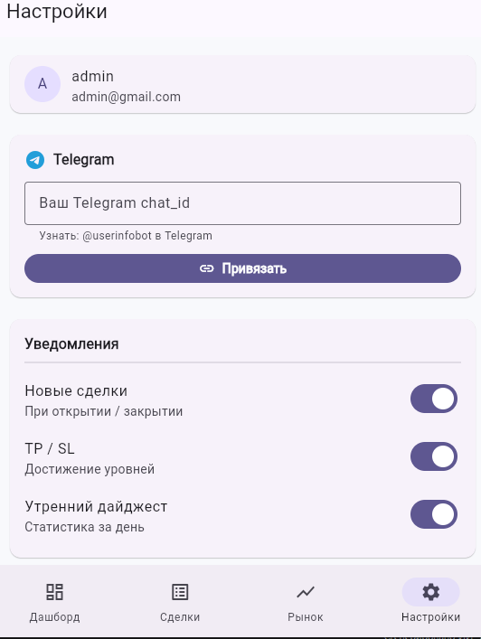

# 📈 Trading Assistant — Full-Stack


AI-ассистент трейдера: журнал сделок, импорт из MetaTrader 5, котировки в реальном времени, Telegram-уведомления.

**🌐 Демо:**
- **Frontend (Flutter Web):** https://trading-assistant-almaz.web.app
- **Backend API (Swagger):** https://trading-assistant-backend-hih7.onrender.com/api/docs/

**🔐 Тестовый аккаунт:**
- Email: `admin@gmail.com`
- Пароль: `admin12345`

---

## 📸 Скриншоты

### Dashboard — статистика


### Trades — журнал сделок


### Market — котировки крипты, форекса и золота


### График BTCUSDT (1H)


### Settings — Telegram и уведомления


---

## ✨ Возможности

### Backend
- 🔐 **JWT-аутентификация** — регистрация, логин, refresh, logout
- 👤 **Кастомная модель User** — email вместо username
- 📝 **Журнал сделок** — 20+ полей, автоматический расчёт PnL
- 🔍 **Фильтры, поиск, сортировка** — по символу, статусу, датам, PnL
- 📊 **Статистика** — Win Rate, total PnL, avg win/loss
- 🤖 **Импорт из MetaTrader 5** — идемпотентность по external_id
- 📈 **Рыночные данные** — Biquote (форекс, золото) + Binance (крипта)
- 🕯️ **Свечи OHLC** — таймфреймы 1H / 4H / 1D
- 🔔 **Telegram-уведомления** — о новых сделках, TP/SL, дайджест
- 🎨 **Django Admin** — с фильтрами и поиском

### Frontend (Flutter)
- 📱 **6 экранов** — Login, Dashboard, Trades, Trade Detail, Market, Settings
- 🌙 **Светлая и тёмная тема**
- 📊 **Графики** — `fl_chart` с динамической осью Y
- 🔐 **Auto-refresh JWT** — токен обновляется автоматически
- 📈 **Рыночные данные** — цены + свечи в реальном времени
- ⚙️ **Управление Telegram** — привязка, тестовое уведомление

---

## 🏗️ Архитектура
┌─────────────────────────────────────────────────┐
│ Flutter Web + Mobile │
│ (Firebase Hosting) │
└─────────────────┬───────────────────────────────┘
│ HTTPS + JWT
▼
┌─────────────────────────────────────────────────┐
│ Django REST API (Render) │
│ ┌────────────────────────────────────────────┐ │
│ │ /api/auth/ → JWT │ │
│ │ /api/trades/ → CRUD + stats │ │
│ │ /api/market/ → prices + candles │ │
│ │ /api/notifications/→ Telegram │ │
│ └────────────────────────────────────────────┘ │
│ PostgreSQL 18 │
└─────────────────▲───────────────────────────────┘
│
│ HTTP (Webhook)
│
┌─────────────────┴───────────────────────────────┐
│ Локальный ПК (Windows) │
│ MetaTrader 5 + Collector (каждые 5 мин) │
└─────────────────────────────────────────────────┘

Внешние API: Biquote (форекс/золото), Binance (крипта),
Telegram Bot API, CoinGecko (резерв)

text

---

## 🏗️ Стек

| Слой | Технологии |
|---|---|
| **Frontend** | Flutter 3.47, Dart 3.13, fl_chart, go_router, http, shared_preferences |
| **Backend** | Python 3.12, Django 5.2, DRF, SimpleJWT |
| **БД** | PostgreSQL 18 |
| **Auth** | JWT (access + refresh), bcrypt |
| **MT5** | MetaTrader5 Python, history_deals_get |
| **Рыночные данные** | Biquote (форекс/золото), Binance (крипта), CoinGecko (резерв) |
| **Уведомления** | Telegram Bot API |
| **Тесты** | pytest, pytest-django, flutter_test (**45+ тестов**) |
| **CI/CD** | GitHub Actions, Auto-Deploy на Render, Firebase Hosting |
| **API docs** | drf-spectacular (Swagger UI) |

---

## 🚀 Быстрый старт

### 1. Клонирование

```bash
git clone https://github.com/KinGsToN-dev/trading-assistant.git
cd trading-assistant/backend
2. Установка
bash
python -m venv .venv
source .venv/bin/activate    # Windows: ..\.venv\Scripts\Activate.ps1
pip install -r requirements.txt
3. Настройка .env
ini
SECRET_KEY=change-me
DEBUG=True
ALLOWED_HOSTS=localhost,127.0.0.1
DB_NAME=trading_assistant_db
DB_USER=trading_user
DB_PASSWORD=change-me
DB_HOST=localhost
DB_PORT=5432
JWT_ACCESS_MINUTES=30
JWT_REFRESH_DAYS=7
MT5_API_TOKEN=change-me
TELEGRAM_BOT_TOKEN=change-me
TELEGRAM_CHAT_ID=change-me
4. Миграции и запуск
bash
python manage.py migrate
python manage.py createsuperuser
python manage.py runserver
Swagger: http://127.0.0.1:8000/api/docs/

Admin: http://127.0.0.1:8000/admin/

5. Frontend (Flutter)
bash
git clone https://github.com/KinGsToN-dev/trading-app-flutter.git
cd trading-app-flutter
flutter pub get
flutter run -d chrome
⚠️ В lib/config/api_config.dart укажите URL backend.

🧪 Тесты
bash
cd backend
python -m pytest -v
45+ тестов:

9 auth

13 trades

6 mt5-import

9 market

8 notifications

CI: GitHub Actions автоматически прогоняет тесты на каждый push.

📊 API
Метод	Путь	Описание
POST	/api/auth/register/	Регистрация
POST	/api/auth/login/	Логин (JWT)
POST	/api/auth/refresh/	Обновить access-токен
GET	/api/auth/me/	Текущий пользователь
POST	/api/auth/logout/	Logout (blacklist refresh)
GET	/api/trades/	Список сделок (фильтры, поиск, сортировка)
POST	/api/trades/	Создать сделку
GET	/api/trades/stats/	Статистика (Win Rate, PnL)
POST	/api/trades/import/mt5/	Импорт из MT5 (X-API-Key)
GET	/api/market/watchlist/	Избранные символы с ценами
GET	/api/market/{symbol}/candles/	Свечи OHLC
POST	/api/notifications/telegram/link/	Привязать Telegram
POST	/api/notifications/test/	Тестовое уведомление
Полная документация: /api/docs/ (Swagger UI).

📁 Структура
text
trading-assistant/
├── backend/
│   ├── config/              # settings, urls, wsgi
│   ├── users/               # User, JWT auth
│   ├── trades/              # Trade, CRUD, MT5-import
│   ├── market_data/         # Prices, candles, Biquote, Binance
│   ├── notifications/       # Telegram
│   ├── ai_agent/            # (зарезервировано)
│   ├── analytics/           # (зарезервировано)
│   ├── tests/               # 45+ тестов
│   ├── tools/mt5_collector/ # Локальный коллектор MT5
│   ├── requirements.txt
│   └── manage.py
├── docs/screenshots/        # Скриншоты для README
├── .github/workflows/       # CI/CD
├── README.md
└── ROADMAP.md
Frontend: trading-app-flutter

🎯 Roadmap
✅ Этап 1-2: Django + JWT + PostgreSQL

✅ Этап 3: Trade CRUD + статистика

✅ Этап 4: MT5-импорт

✅ Этап 5: Рыночные данные (Biquote + Binance)

✅ Этап 7: Telegram-уведомления

✅ Этап 8.1: Flutter-приложение (6 экранов)

✅ Этап 8.2: Деплой (Render + Firebase)

⏳ Этап 6: AI-агент (OpenAI Vision)

⏳ Этап 8.3: Firebase Auth + FCM + Firestore

⏳ Этап 8.4: Offline-режим + deep links

Подробности: ROADMAP.md.

📄 Лицензия
MIT

👤 Автор
Кингстон (KinGsToN-dev)